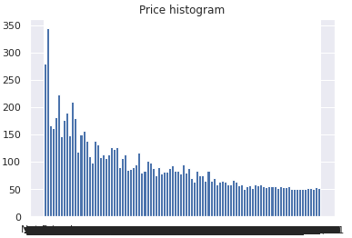
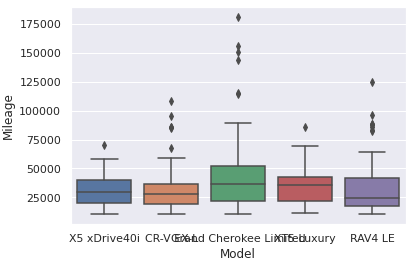

# ACM Research coding challenge (Fall 2022)

## Summary of the Problem
I am relatively new to working with Kaggle Datasets in a Data Science setting, I previously had some experience in CS 4395 Human Language Technologies course. In there I learned about Natural Language Processing and used some of the libraries I used in this project. A for the Probelm I wanted to solve, I was going for an all around exploration of the data. The beginning was more basic commands and visualations of the data and I worked my way up to displaying it in a box plot and histogram.

## Process of Analyzing the Data
First I began with displaying the columns and number of rows followed by the head of the data. This was my way of "starting off small to make sure I could print basic data sections. Next I decided to make a function called return_counter that takes as input a data frame, column name, and limit. When called, it prints a dictionary of categorical values and how frequently they appear. I used it to print the 5 most common Makes from the data. Next I used it to get the 5 most common Years and lastly the 5 most common Exterior Colors. Next I defined a dictionary df_d1 and printed it to give me all the Years of all the Toyota cars in the dataset. Next I used the same dictionary to print the 5 most common years for Toyota vehicles. Lastly I used it to get the 5 most common Exteriro Colors of Toyota Vehicles. Next I defined a function return_statistics function that takes a data frame, a categorical column, and a numerical column. The mean and standard deviation of the numerical column for each category is stored in a data frame and the data frame is sorted in descending order according to the mean. I then used that function with the Categorical Column as 'Model' and the Numerical Column as 'Mileage'. It then outputs 15 Models and their mean Mileage and the standard deviation of the mileage as well respectively. Next I defined a function called get_boxplot_of_categories that function takes a data frame, categorical column, and numerical column and displays boxplots for the most common categories based on the limit. The input for the Categorical Column was 'Model' and the input Numerical Column 'Mileage'. Lastly I defined a function get_histogram that takes a data frame and a numerical column as input and displays a histogram. I called the function with the data frame and generated a histogram from ‘Price’. That completes all of my visualizations of the data. 

## Graphs

